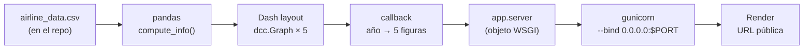

# Tarea — Construcción y publicación de un dashboard interactivo con Dash

## 1. Resultado de aprendizaje

Al terminar esta tarea serás capaz de:

1. **Construir** un tablero interactivo con Dash: `layout` + `callbacks`.
2. **Empaquetar** la aplicación para producción: objeto WSGI, dependencias, puerto y variables de entorno.
3. **Publicar** el tablero en Internet con una URL pública y comprobar que funciona.
4. **Documentar** el proyecto en un `README.md` que cualquier persona pueda reproducir.

---

## 2. Escenario

Trabajas como analista de datos en el área de operaciones de una aerolínea. La
dirección quiere saber **por qué se retrasan los vuelos** y, sobre todo, quiere
consultarlo por sí misma sin depender de ti.

Te piden, por tanto, **un tablero web** donde se pueda elegir un año y ver, en el
momento, el tiempo promedio de demora por aerolínea y por mes, separado por
**causa**: transportista (*carrier*), clima, sistema aéreo nacional (NAS),
seguridad y aeronave tardía (*late aircraft*).

El tablero debe quedar **publicado en Internet** para que la dirección lo abra
desde el navegador, sin instalar nada.

---

## 3. Entrega

La tarea se entrega con **una sola cosa: la URL pública del dashboard**.

El docente abre ese enlace en el navegador y comprueba que:

- carga sin errores y sin instalar nada,
- muestra los cinco gráficos, y
- se actualiza al cambiar el año.

> No se entregan capturas ni documentos: si el enlace no funciona, la tarea no
> está terminada. Compruébalo en una ventana de incógnito antes de enviarlo.

---

## 4. Requisitos funcionales del dashboard (RF)

Tu dashboard debe cumplir **todos** estos requisitos:

- [ ] **RF1 — Título.** Un encabezado visible que identifique el tablero (marca, producto o propósito).
- [ ] **RF2 — Control de entrada.** Un campo numérico para elegir el **año** (`dcc.Input`, `type="number"`), con un valor por defecto razonable (por ejemplo `2010`).
- [ ] **RF3 — Cinco visualizaciones.** Cinco gráficos, cada uno dentro de su propio `dcc.Graph`. Los `id` deben ser **exactamente** estos, porque son los que se revisarán:
  `carrier-plot`, `weather-plot`, `nas-plot`, `security-plot`, `late-plot`.
- [ ] **RF4 — Un solo callback.** **Un único** callback `@app.callback(...)` que reciba el año y devuelva las cinco figuras (una salida `figure` por gráfico).
- [ ] **RF5 — Robustez.** El tablero **no debe caerse** si el usuario borra el campo o escribe algo no numérico o fuera del rango con datos: debe mostrar un aviso o gráficos vacíos con un mensaje claro.
- [ ] **RF6 — Cálculo separado.** La preparación de los datos debe estar en una **función propia** (por ejemplo `compute_info(datos, año)`), separada del callback, que devuelva las tablas ya agrupadas.
- [ ] **RF7 — Calidad visual.** Cada gráfico con título propio; ejes rotulados e **indicando unidades** (minutos); una leyenda que permita identificar la aerolínea; colores legibles (no distinguir series solo por rojo/verde).
- [ ] **RF8 — Datos locales.** El archivo de datos viaja **dentro del repositorio** y se lee con una ruta relativa al propio módulo:
  `DATA_FILE = Path(__file__).with_name("airline_data.csv")`.
  Nunca uses rutas absolutas del tipo `C:\Users\...` (en el servidor no existen).
- [ ] **RF9 — Objeto WSGI.** El módulo debe exponer la variable `server = app.server`, que es la que consumirá el servidor de producción.
- [ ] **RF10 — Layout ordenado.** Los gráficos se distribuyen en bloques (rejilla o filas) usando `style`/`className`; no deben quedar todos apilados de forma ilegible.

> **Los `id` de RF3 y el objeto WSGI de RF9 no son sugerencias: son el contrato
> que permite al docente verificar el tablero automáticamente.**

---

## 5. Estructura de archivos obligatoria

El repositorio debe tener **exactamente** este contenido en la raíz:

```text
nombre-apellido-dashboard/
├── dashboard.py          # la aplicación Dash  (RF1–RF10)
├── airline_data.csv      # los datos, dentro del repo
├── requirements.txt      # dependencias (incluye gunicorn)
├── Procfile              # comando de arranque (formato Heroku)
├── render.yaml           # infraestructura como código para Render
├── .python-version       # versión de Python del servidor
├── .gitignore            # excluye .venv/ y basura de Python
└── README.md             # documentación del proyecto
```

`Procfile` y `render.yaml` **deben incluir los dos**, aunque tu plataforma solo
lea uno: son la prueba de que sabes configurar un despliegue.



---

## 6. Archivos requeridos y su contenido

### 6.1 `dashboard.py` — plantilla de partida

Copia esta plantilla y **completa cada `TODO`**. El archivo debe quedar
ejecutable y sin `TODO` pendientes.

```python
"""Dashboard interactivo de retrasos de vuelos (tarea).

Ejecutar en desarrollo:
    python dashboard.py        ->  http://127.0.0.1:8050

Ejecutar en produccion (lo hace la plataforma de despliegue):
    gunicorn dashboard:server  ->  usa el objeto WSGI `server` de este modulo
"""

from pathlib import Path

import pandas as pd
import plotly.express as px
from dash import Dash, Input, Output, dcc, html

# --------------------------------------------------------------------- datos
# Los datos viajan CON el repositorio y se leen desde la carpeta del archivo.
# NO uses rutas absolutas: en el servidor las rutas son distintas.
DATA_FILE = Path(__file__).with_name("airline_data.csv")

df = pd.read_csv(
    DATA_FILE,
    encoding="ISO-8859-1",
    # Estos campos traen ceros a la izquierda: deben leerse como texto.
    dtype={
        "Div1Airport": str,
        "Div1TailNum": str,
        "Div2Airport": str,
        "Div2TailNum": str,
    },
)

app = Dash(__name__)

# -------------------------------------------------------------------- layout
# TODO 1: construye app.layout con:
#   * html.H1  -> el titulo del tablero
#   * dcc.Input(id="input-year", type="number", value=2010, ...)
#   * cinco dcc.Graph con estos id EXACTOS:
#       carrier-plot, weather-plot, nas-plot, security-plot, late-plot
#   * bloques html.Div con style={"display": "flex"} para ordenarlos
app.layout = html.Div(children=[
    # ... aqui va tu layout ...
])


# ------------------------------------------------------------------ calculos
def compute_info(datos, entered_year):
    """Devuelve 5 tablas (una por causa de retraso) para el ano pedido.

    Cada tabla debe tener las columnas: Month, Reporting_Airline y el
    promedio de la causa correspondiente.
    """
    # TODO 2: filtra por ano y agrupa por ["Month", "Reporting_Airline"]
    #         con .mean() sobre: CarrierDelay, WeatherDelay, NASDelay,
    #         SecurityDelay y LateAircraftDelay
    raise NotImplementedError


# ------------------------------------------------------------------ callback
# TODO 3: un UNICO callback que reciba el ano y devuelva las cinco figuras.
#         Recuerda: el numero de Output debe coincidir con el numero de
#         elementos que retorna la funcion, y en el mismo orden.
#
# @app.callback(
#     [Output("carrier-plot", "figure"), ..., Output("late-plot", "figure")],
#     Input("input-year", "value"),
# )
# def get_graph(entered_year):
#     # RF5: si entered_year es None o no es numerico, devuelve figuras vacias
#     #      con un mensaje en vez de lanzar una excepcion.
#     ...

# --------------------------------------------------------------- produccion
# RF9: objeto WSGI que consumira gunicorn. gunicorn IMPORTA este modulo y
# busca una variable llamada `server`; nunca ejecuta el bloque __main__.
server = app.server

if __name__ == "__main__":
    # debug=True recarga el servidor al guardar: comodo en desarrollo,
    # y NUNCA se usa en produccion.
    app.run(debug=True, port=8050)
```

**Pistas concretas**

- Para las figuras usa `plotly.express.line(...)` con `x="Month"`, `y=<causa>` y `color="Reporting_Airline"`.
- Ojo con `plotly` moderno: `px.line()` **sin `data_frame` falla**. Para una figura vacía usa `from plotly.graph_objects import Figure` y `Figure()`.
- Si el año elegido no tiene datos, los gráficos quedan vacíos: es correcto, pero avísalo en el título.
- Añade `import` solo de lo que uses (`from dash import Dash, Input, Output, dcc, html`).

### 6.2 `airline_data.csv` — los datos

Usa el archivo entregado en clase (opción guiada) o un dataset propio (opción libre).

|                 | Opción A — guiada                                                                                                                    | Opción B — libre                                  |
| --------------- | -------------------------------------------------------------------------------------------------------------------------------------- | --------------------------------------------------- |
| Fuente          | `airline_data.csv` del curso (muestra de *Airline Reporting Carrier On-Time Performance*)                                          | un dataset público que elijas y cites              |
| Tamaño mínimo | 27.000 filas, años 1987–2020, 33 aerolíneas                                                                                         | ≥ 5.000 filas                                      |
| Columnas clave  | `Year`, `Month`, `Reporting_Airline`, `CarrierDelay`, `WeatherDelay`, `NASDelay`, `SecurityDelay`, `LateAircraftDelay` | 1 variable temporal, 1 categórica y ≥ 2 métricas |

### 6.3 `requirements.txt` — dependencias

Versiones esperadas (pueden variar algo según tu entorno):

```text
dash==4.4.1
pandas==3.0.6
plotly==7.1.0
gunicorn
```

Cómo generarlo bien (con las versiones que **realmente** usaste):

```powershell
# Windows + PowerShell 5.1: `pip freeze > requirements.txt` escribe el archivo
# en UTF-16LE y en el servidor Linux `pip install -r` falla al leerlo.
# Usa esta forma:
pip freeze | Set-Content -Encoding utf8 requirements.txt

# y luego anade el servidor WSGI de produccion:
Add-Content requirements.txt "`ngunicorn"
```

### 6.4 `Procfile` — comando de arranque

```text
web: gunicorn dashboard:server --bind 0.0.0.0:$PORT --timeout 120
```

**Cómo se lee:** `dashboard` es el archivo `dashboard.py` **sin** la extensión,
`server` es la variable de RF9, y `$PORT` es el puerto que la plataforma asigna por variable de entorno. `--timeout 120` evita que gunicorn mate la petición mientras el proceso lee el CSV.

### 6.5 `render.yaml` — infraestructura como código

```yaml
services:
  - type: web
    name: apellido-flight-dashboard   # debe ser unico en toda la plataforma
    runtime: python
    plan: free                        # declarar SIEMPRE: el plan por defecto es de pago
    buildCommand: pip install -r requirements.txt
    startCommand: gunicorn dashboard:server --bind 0.0.0.0:$PORT
    healthCheckPath: /
    autoDeployTrigger: commit
```

### 6.6 `README.md` — documentación del proyecto

Tu README debe contener, como mínimo, estas secciones:

| Sección                  | Qué debe explicar                                                      |
| ------------------------- | ----------------------------------------------------------------------- |
| Título y URL pública    | Enlace al dashboard publicado, bien visible al principio                |
| Descripción              | Qué muestra el tablero y para quién está pensado                     |
| Tabla de componentes      | Cada `id` de RF3, qué dato grafica y en qué bloque del layout está |
| Cómo ejecutarlo en local | Paso a paso: crear entorno virtual, instalar, ejecutar y qué URL abrir |
| Estructura del proyecto   | Árbol de archivos con una línea explicando cada uno                   |
| Datos                     | Fuente, licencia, número de filas, años cubiertos y transformaciones  |
| Decisiones de diseño     | Por qué ese gráfico, esos colores, esa distribución                  |
| Autoría                  | Nombre y fecha                                                          |

---

## 7. Publicar el dashboard (despliegue)

> **Aclaración de vocabulario:** *Dash* es la **librería** con la que construyes el
> tablero; no aloja aplicaciones. "Publicar en Dash" significa **desplegar la
> aplicación Dash** en un servicio que ejecute un servidor WSGI con una URL
> pública. El camino recomendado aquí es **Render** (tiene plan gratuito y un
> flujo guiado). Alternativas válidas: Fly.io, Hugging Face Spaces, PythonAnywhere
> o un servidor propio (gunicorn + nginx). **Comprueba antes el plan vigente de
> cada plataforma**, porque cambian con frecuencia.

- [ ] **Paso 1.** Crea la cuenta en la plataforma usando **la misma cuenta de GitHub**.
- [ ] **Paso 2.** Despliega con una de las dos opciones:

  - **Opción A (recomendada, automática):** *New → Blueprint → seleccionar el repositorio → Apply*. La plataforma lee `render.yaml` y configura todo sola.
  - **Opción B (manual):** *New → Web Service → conectar GitHub → elegir el repo* y rellenar los campos de esta tabla:

| Campo              | Valor                                            |
| ------------------ | ------------------------------------------------ |
| Language / Runtime | Python                                           |
| Build Command      | `pip install -r requirements.txt`                |
| Start Command      | `gunicorn dashboard:server --bind 0.0.0.0:$PORT` |
| Instance Type      | **Free**                                         |
| Health Check Path  | `/`                                              |

- [ ] **Paso 3.** Vigila la pantalla **Logs** hasta que el estado sea *Live*.
- [ ] **Paso 4.** Abre la URL `https://<nombre>.onrender.com`, escribe `2010` y comprueba que los cinco gráficos se dibujan.
- [ ] **Paso 5.** Prueba la URL en una **ventana de incógnito** (sin tu sesión) y, si puedes, en el móvil. Copia la URL y **no la modifiques después**.
